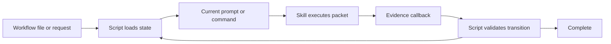

# Workflow engine



A working local prototype of a generic workflow facility below ShipLoop.
**Files remember. Scripts decide. The skill follows the current packet.**

A workflow can be an ordered list or dependency graph of commands, prompts and
native agent tasks. A single request can enter through Backchain planning and
then use the same executor. `next` reconstructs the current action from durable
Markdown; it never asks the model to remember or choose what follows.

Requires Python 3.10+ and macOS/Linux. There are no Python package dependencies.
The optional Backchain adapter additionally requires Node, Bash and a selected
Backchain source checkout. The optional worktree adapter requires Git.

## Try a script workflow

From this checkout, use an unused run and an empty working directory:

```sh
mkdir -p /tmp/workflow-example-workspace
python3 skills/workflow/scripts/workflow init \
  --workflow examples/serial.workflow.json \
  --repo /tmp/workflow-example-workspace \
  --run-dir /tmp/workflow-example-run
python3 skills/workflow/scripts/workflow run --run-dir /tmp/workflow-example-run
python3 skills/workflow/scripts/workflow next --run-dir /tmp/workflow-example-run
```

The script writes `numbers.csv`, then `report.json`, then `verification.txt`.
The final packet has `status=complete`. Running `next` from a fresh process returns
the same terminal state without rerunning the commands. Choose different unused
directories for another run; initialization never overwrites an existing run.

`examples/diamond.workflow.json` demonstrates a join waiting for both suppliers.
The pilot executes ready nodes serially. Omitted `needs` means “after the previous
step”; explicit `needs: []` declares an independent root.

## Start from a prompt

```sh
python3 skills/workflow/scripts/workflow init \
  --prompt-file examples/request.txt \
  --backchain-root /absolute/path/to/backchain \
  --repo /absolute/path/to/working-directory \
  --run-dir /absolute/path/to/new-run
```

The returned planning packet directs the host to use the selected Backchain skill,
write a plan and execution bindings, and submit `accept-plan`. The runtime invokes
Backchain's real `--package-only` validator, freezes the accepted graph and chooses
the first action. Structural plan acceptance and successful execution are separate
receipts. The full Backchain skill's native convergence is a planning obligation;
the structural CLI cannot prove semantic review quality.

An `agent` packet is a native ask-agent handoff. The driver records launch intent
before spawning and saves the actual returned handle afterward. The worker writes
only its assigned outputs; the host collects its result and submits the exact
completion callback. The script checks outputs and declared verifiers before
advancing. The engine never starts an undocumented model subprocess.

The portable driver is [SKILL.md](skills/workflow/SKILL.md). It is source-only in
this repository; this prototype has not installed or published a host skill.

## State and recovery

`state.md` is authoritative. `packet.md` is a derived recovery view. Immutable
receipt files bind accepted results to the action and output hashes. ShipLoop's
extracted write-ahead Markdown store commits these together and rolls interrupted
transactions forward under a local process lock.

Exact completion replay is harmless. Stale or conflicting callbacks fail. A
command whose outcome is uncertain is not rerun automatically; use the saved
process/effect evidence to reconcile it. Explicit retry requires a reason and
confirmation that the former writer stopped. Its new action identity rejects old
callbacks, and old output files alone cannot satisfy the new attempt.

Only the script's terminal status proves this run completed. Exit zero can also
mean “waiting for a prompt result” or “blocked.” Workflow documents and verification
commands are trusted executable input, not a sandbox or authorization grant.

Declared outputs are immutable evidence. For coding tasks that later edit the same
source, emit a separate report/snapshot instead of declaring that changing source
file as the permanent evidence artifact.

## Optional worktree isolation

Add `--isolate` at initialization for a clean Git source. The run directory must
be outside the source repository. The engine records HEAD and creates a detached
worktree at `RUN/workspace`; all execution uses that path. The source checkout is
preserved. The worktree remains for inspection; this pilot does not merge or return
changes, capture dirty baselines, or delete worktrees automatically.

## Scope and evidence

Implemented scope: frozen list/DAG, durable file state, script-owned packets,
command execution, prompt and native-agent callbacks, Backchain structural import,
and clean Git run isolation. A dependency DAG does not establish concurrency safety.

This is a sibling extraction pilot. ShipLoop continues using its own runtime.
Child-engine integration, the full SDLC adapter, dynamic graph revision, concurrent
workers and guarded source return are later adoption gates. See
[the architecture and extraction plan](docs/ARCHITECTURE.md) and
[the implementation contract](docs/PROTOTYPE-CONTRACT.md).

Run the deterministic suite:

```sh
python3 -m unittest discover -s tests -v
```

Tests use temporary workspaces; real Backchain integration is reported separately
from simulated protocol checks. [Validation evidence](docs/VALIDATION.md) records
what actually ran, including any native-agent pilot and remaining limits.

The reused storage module retains the upstream MIT license. Exact source
provenance is in [PROVENANCE.json](docs/PROVENANCE.json).
