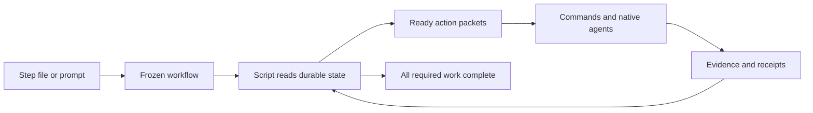
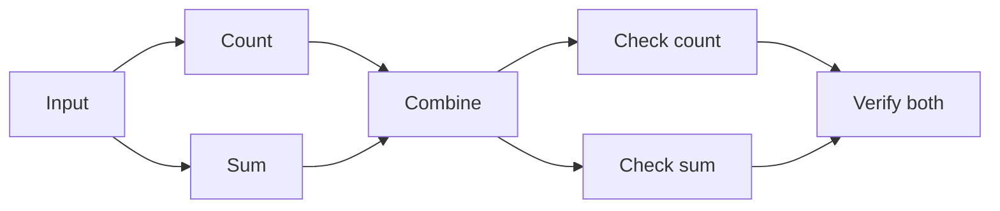

# Weave

**Files remember. Scripts decide. Skills do the work.**

Weave is a local workflow facility for durable sequences and dependency graphs.
Give it a file of steps, or a request that Backchain turns into steps. The script
tells the host exactly what is ready, accepts verified results, and keeps going
until every required step is complete.



The standalone repository is [whichguy/workflow-engine](https://github.com/whichguy/workflow-engine).
**Weave** is its display name; **workflow** is its portable skill and marketplace
plugin identifier. The short checkout command is `./weave`. The canonical skill
and CLI remain under `skills/workflow/`; `plugins/workflow/` is a generated,
relocatable distribution view. This release is an experimental local engine.

## Install from skill-craft-market

For Codex:

```sh
codex plugin marketplace add https://github.com/whichguy/skill-craft-market.git
codex plugin add workflow@skill-craft-market
```

For Claude Code:

```sh
claude plugin marketplace add whichguy/skill-craft-market
claude plugin install workflow@skill-craft-market
```

Then invoke the loaded **workflow** skill: “Use Weave to run this recipe and
collect every branch.” In Codex, `$workflow` selects the installed skill. The
skill binds the CLI beside its own loaded card; it does not use the author checkout.
Existing marketplace users should refresh that marketplace before installing.

Command-only recipes need Python 3.10+ and no other skills. For native agent
steps, separately install `ask-agent@skill-craft-market`. For prompt planning,
select Backchain and Until Loop from the same marketplace; Backchain repository
access may require authentication. The selected Backchain root must include its
packaging harness and schema, not just a copied skill card. Dependencies are
conditional and reused; Weave does not bundle their skill bodies or auto-install
them. See [dependency selection](skills/workflow/references/dependencies.md) and
[distribution qualification](docs/DISTRIBUTION.md).

## What we care about

| Value | Observable behavior |
| --- | --- |
| Durable truth lives in files | `state.md` holds the frozen graph, attempts, handles and outcomes. A new conversation recovers from the run directory. |
| Scripts own transitions | The host follows packets. It never picks successors, edits state, or marks work done from memory. |
| Small recoverable context | A packet contains the bounded task, workspace, direct dependency receipts and exact callbacks. Load detail when needed. |
| Ready and done mean something | Every direct prerequisite needs an accepted receipt; outputs and declared checks must pass before acceptance. |
| Every branch counts | Joins wait for all suppliers. Completion waits for every required step, including terminal leaves with no explicit join. |
| Native judgment stays native | Backchain plans; ask-agent delegates through host tools. The runtime has no hidden model launcher. |
| Recovery is honest | Unknown effects require reconciliation. A timeout does not prove a worker stopped; a handle does not prove the host can reconnect. |
| Composition stays simple | ShipLoop supplies delivery policy. Improve keeps its own review loop. Their integration is a separate adapter milestone. |

## A small vocabulary

**Weave** is the facility. A **recipe** is a workflow definition; a **run** is one
execution. A **packet** is a script-issued work order; a **receipt** is accepted
evidence. The JSON contract keeps ordinary terms such as `steps`, `needs`,
`outputs`, `active_actions` and `completed`.

| Recipe | Shape | Start with steps | Start with a prompt |
| --- | --- | --- | --- |
| Relay | A sequence | [serial.workflow.json](examples/serial.workflow.json) | [request.txt](examples/request.txt) adds a native reporting step |
| Diamond | One fork and join | [diamond.workflow.json](examples/diamond.workflow.json) | See Braid |
| Braid | Fork, join, fork, join again | [braid.workflow.json](examples/braid.workflow.json) | [braid.request.txt](examples/braid.request.txt) |
| Confetti | Terminal fan-out; wait for all | [confetti.workflow.json](examples/confetti.workflow.json) | [confetti.request.txt](examples/confetti.request.txt) |
| Tributaries | Uneven paths and independent roots | [tributaries.workflow.json](examples/tributaries.workflow.json) | [tributaries.request.txt](examples/tributaries.request.txt) |
| Native Braid | Two rounds of concurrent native agents | [native-braid.workflow.json](examples/native-braid.workflow.json) | [native-braid.request.txt](examples/native-braid.request.txt) |
| Loom | Overlapping joins, another fork, and an independent terminal leaf | [loom.workflow.json](examples/loom.workflow.json) | [loom.request.txt](examples/loom.request.txt) |

## Try an authored recipe

Requires Python 3.10+ on macOS/Linux; there are no Python package dependencies.
From this checkout:

```sh
DEMO=$(mktemp -d)
mkdir "$DEMO/workspace"
./weave init --workflow examples/braid.workflow.json \
  --repo "$DEMO/workspace" --run-dir "$DEMO/run"
./weave run --run-dir "$DEMO/run"
./weave next --run-dir "$DEMO/run"
```

`run` executes commands and stops at host work or a blocker. Command-only Braid
finishes by itself. Confetti stops for prompt callbacks; Native Braid stops for
native dispatch. Only `status=complete` means completion—exit zero can mean
“waiting.” Another `next` reads the durable result without rerunning effects.
Keep the temporary directory to inspect outputs and receipts.

Omitted `needs` means “after the previous step.” Explicit `needs: []` makes a root.
An explicit array names all direct prerequisites. Declaration order is not a
dependency. Every step in the frozen recipe is required.

## Start from a prompt

```sh
./weave init --prompt-file examples/braid.request.txt \
  --backchain-root /absolute/path/to/backchain \
  --repo /absolute/path/to/workspace --run-dir /absolute/path/to/new-run
```

The planning packet directs the host to load the selected Backchain skill, perform
its dependency discovery and selected convergence procedure, and write a plan plus
explicit execution bindings. Current Backchain delegates recurrence to its selected
Until Loop. Retain the actual terminal receipt and candidate-bound domain evidence
in the planning companion, then submit the packet's `accept-plan` command. The
script invokes Backchain's real package-only validator and freezes the graph.
No executable command is guessed from planning prose.

The companion documents semantic planning; packaging proves structural acceptance;
execution receipts prove completed work. These are distinct claims. Automated
prompt examples use authored plan fixtures to test the adapter, not to claim that
a model produced or reviewed them. See [planning guidance](skills/workflow/references/planning.md).

To invoke the source skill in a host session, say:

> Use Weave from `/absolute/path/to/workflow-engine/skills/workflow/SKILL.md`.
> Run `examples/native-braid.workflow.json` in this workspace with up to two
> independent agents. Follow the packets through completion and collect every branch.

Or:

> Use that Weave skill with this prompt: “Create an input dataset, independently
> calculate its count and sum, combine them, independently produce two reports,
> and verify both reports.” Use Backchain and keep a durable run directory.

The installed skill is named `workflow`; `weave` is the checkout command and
display name. Source-card invocation remains available without installation.

## Fork, join, fork, join



For Native Braid, Input first earns a command receipt. The script can then claim
Count and Sum together. If Sum finishes first, Combine remains held. Accepting
Count releases Combine; its receipt releases both checks. Verify both waits
for both check receipts. Only its acceptance completes this run.

In Confetti, the final branches have no successor. Finishing one leaf leaves the
others pending. No dummy “finish” step is needed: the script checks every required
step, not the identity of the last-listed step. A failed, blocked or uncertain
leaf keeps the run incomplete.

Serial traversal is the default. Enable actual native-agent concurrency with:

```sh
./weave init --workflow examples/native-braid.workflow.json \
  --repo /absolute/path/to/workspace --run-dir /absolute/path/to/new-run \
  --max-active 2 --shared-workspace-disjoint
./weave run --run-dir /absolute/path/to/new-run
```

The flag declares that concurrent agents own separate output files and will not
modify each other's work or other shared resources. Every concurrent agent needs
declared outputs. Commands, prompts and planning run exclusively. This is trusted
cooperative ownership, not a filesystem sandbox; one run-level worktree does not
isolate branches from each other.

The v2 driver claims ready work, prepares each native launch, records each real
handle, and collects all required native results. A claim does not launch work.
`next` never claims or launches. Recovered launch intent requires reconciliation.
Existing v1 runs retain the serial protocol. See [concurrency](docs/CONCURRENCY.md)
and [the driver skill](skills/workflow/SKILL.md).

## Evidence, recovery and isolation

`state.md` is authoritative; `packet.md` is derived. Immutable receipts bind results
to attempts and output hashes. The extracted ShipLoop Markdown store commits state
and receipts together with write-ahead recovery. Exact callback replay is harmless;
stale or conflicting callbacks fail. Retry requires a reason and confirmation that
the old writer stopped. It issues a new identity but cannot stop a stray writer
whose owner gave a false confirmation.

Prompt and agent completion persist verifier intent before running checks. A live
check appears as `verifying`; cold reads can inspect it without rerunning it.
If its owner dies before recording an outcome, the action becomes `in_doubt`.
Reconcile the verifier process and effects before an explicit retry. Concurrent
completion calls serialize their verifiers within a run; accepted callbacks replay
without executing checks again. This does not promise exactly-once external effects.

Declared outputs are immutable evidence. If later steps edit the same source files,
declare a report or snapshot as output evidence instead of that mutable source.
Output declarations reject case-folded or Unicode-normalized aliases and file/path
prefix overlaps, even on case-sensitive hosts. Existing symlink components and
hardlinked output files are rejected. These checks reduce accidental aliasing;
they do not enforce which trusted worker writes a shared file.
Workflow documents and verification commands are trusted executable input. They
do not grant authority for external sends, publication or other effects.

Add `--isolate` at initialization for a clean Git source. Weave pins HEAD and creates
a detached worktree at `RUN/workspace`; the run directory must be outside the
source. The worktree remains for inspection. There is no automatic merge,
dirty-baseline capture, source return or cleanup.

## References and verification

The [release dependency audit](docs/DEPENDENCY-AUDIT.md) compares selected sources
with published revisions, including newer ShipLoop context-reset work. The
[reference-skill audit](docs/REFERENCE-SKILLS.md) assigns clear roles to ShipLoop,
Backchain, ask-agent, Improve/Until Loop, skill-interop and skill-creator. ShipLoop
has not migrated to this engine. See [architecture](docs/ARCHITECTURE.md) for that
adoption path and [provenance](docs/PROVENANCE.json) for the reused MIT-licensed store.

| Surface | Requirement | Verified scope |
| --- | --- | --- |
| Script execution | Python 3.10+, local POSIX filesystem | Automated CLI tests on this macOS host |
| Prompt planning | Selected Backchain checkout, Node and Bash | Real packaging tests; native planning pilot documented separately |
| Native agent steps | Host fresh-context async delegation and collection | Codex local pilot; no Claude/Grok/Hermes execution claim |
| Run isolation | Git and a clean source root | Real detached-worktree tests |
| Distribution | Explicit marketplace installation | Generated Claude/Codex package; exercised qualification recorded in [DISTRIBUTION.md](docs/DISTRIBUTION.md) |

```sh
python3 -m unittest discover -s tests -v
```

Tests use temporary directories. [The example guide](examples/README.md) maps
recipes to behavioral tests; [validation](docs/VALIDATION.md) records actual runs
and limits. Backchain tests explicitly skip if its checkout is absent;
`WORKFLOW_TEST_BACKCHAIN_ROOT` selects another checkout.

The [adversarial validation plan](docs/experiments/validation-plan.md) and
[experiment results](docs/experiments/RESULTS.md) connect assumptions to crash,
race, generated-graph and negative-control tests. To run a larger reproducible
graph corpus separately:

```sh
python3 experiments/graph_matrix.py --seeds 20 --output /tmp/weave-graph-matrix.json
```
