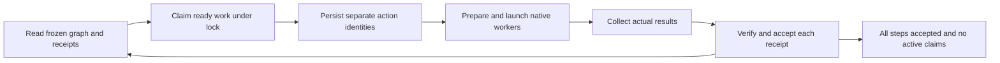

# Native frontier protocol v2



## Scope and entry

The default v1 executor is serial and old runs keep that behavior. Both authored
workflow and prompt initialization can opt into v2 with:

```sh
./weave init --workflow examples/native-braid.workflow.json \
  --repo /absolute/workspace --run-dir /absolute/new-run \
  --max-active 2 --shared-workspace-disjoint
```

The frozen workflow document stays version 1. Concurrent run state uses version 2;
legacy/default run state remains version 1. The run's execution policy selects
native-agent concurrency and binds its capacity and workspace rule. Existing v1
state is not silently upgraded. Only `agent` steps run concurrently. Commands,
prompts and planning are exclusive workspace owners.

This pilot uses explicit cooperative ownership: concurrent agents write only their
own non-overlapping declared outputs, have no undeclared shared effects, and do
not delegate again. Every such agent must declare outputs. The flag is a caller
attestation, not a sandbox. There are no per-agent worktrees, automatic merges,
resource locks for external systems, or concurrent command execution.

Verifiers are trusted executable code too. Their effects must respect the same
ownership rule as the action they verify. Verifiers from concurrent completion
callbacks serialize under one execution lock, while native agents can still be
working. Serialization therefore does not authorize a verifier to modify a sibling's
outputs. A retained adversarial probe demonstrates that a receipt cannot identify
which worker wrote a shared file; see [experiment results](experiments/RESULTS.md).

## Durable frontier

A v2 `state.md` retains `active_actions`, one entry per action, with independent
attempt IDs, output preimages, launch intents and native handles. The original
planning action stays exclusive until a graph is accepted. `packet.md` is derived.
The same transaction store and local run lock protect claims and acceptance.

`next` returns a `workflow-frontier-v2` overview:

- `ready_frontier`: dependency-ready steps, not launch permission. Capacity and
  exclusive workspace ownership can still prevent a claim.
- `active_packets`: bounded work orders for durable active claims.
- `max_active` and `active_count`: capacity and current ownership.
- `status`: aggregate condition. A failed branch may coexist with independent work;
  only `complete` is terminal success.

Every ready step requires receipts for **all direct `needs`**. A later wave is not
an execution barrier: an agent depending only on a finished branch can become ready
while another branch is still active. Commands remain exclusive even if their data
dependencies are satisfied. Failed/blocked claims retain their ownership until
reconciled; their dependants stay held while other disjoint agent work may proceed.

## Claim, dispatch, collect

```sh
./weave claim-ready --run-dir /absolute/run --limit 2 --request-id round-one
```

The script chooses steps under the lock. The response contains `claimed_action_ids`
and `claimed_packets`. The same request ID and limit replay the claim without
allocating more work; a changed limit is rejected. A replay may show fewer active
packets because some originally claimed actions have since completed. Never launch
from a remembered ID alone. A genuinely new scheduling request needs a new ID.

For each claimed agent:

1. Call its exact `prepare-dispatch` command to persist launch intent.
2. Only the direct response's targeted `prepared_packet` with `launch_once` permits
   native launch. Other active packets are recovery views. A cold `next`
   or repeated preparation is reconciliation-only.
3. Use ask-agent with fresh native context, explicit workspace and output ownership.
4. Persist the actual returned handle via that action's `dispatch` callback.
5. Continue independent parent work; collect native results when needed.
6. Submit the exact `complete` callback. The script checks outputs/verifiers,
   accepts that receipt and removes only that claim.

Native waits may return after the first result. Keep the remaining workers pending.
A file appearing or a worker exiting is not an accepted successful receipt. The
host reports actual native task status; the script separately decides acceptance.

For claimed command actions use `execute`; for prompt actions use the ordinary
host completion callback. `run` automates exclusive command actions and stops at
host work. It does not launch or silently complete an agent.

## Joins and terminal leaves

Native Braid starts with A, claims B/C, accepts both before D, claims E/F, and accepts
both before G. A completion can arrive in either order; accepting C does not
invalidate B's identity. Claim races must issue one active identity per step.

For A → {B,C}, where B and C are both leaves, B's receipt leaves C pending. C may
have no successor, but it remains a required node. Terminal success requires every
declared step's accepted receipt **and no active claims**. There is no first-winner,
quorum, implicit skip or optional-leaf mode.

Each acceptance verifies immutable prior evidence as well as the current outputs.
Same-result callbacks replay safely; conflicting callbacks fail. Explicit retry
requires a stopped-writer attestation and new attempt identity for only that action.
It does not reset successful siblings. Identity fencing rejects stale callbacks;
it cannot prevent writes by an old process that was incorrectly declared stopped.

## Verifier recovery

A successful prompt/agent callback first persists `verifying`, its callback
identity and verifier intent. Each verifier's launch and outcome are recorded;
the run lock is released while the child runs so `next` can observe progress.
Completion callers serialize on a separate process-held execution lock. A live
owner yields a read-only verifying packet. A dead owner with no durable outcome
parks that action `in_doubt`; another sibling holding the execution lock cannot
make the dead action live again. Do not resubmit the callback as a recovery tactic.
Inspect the saved process and effects, confirm all former writers stopped, then
use explicit retry if appropriate. A nonzero check parks the action `failed`.

The path policy compares NFC-normalized, case-folded output components and rejects
equal names or ancestor/descendant overlaps. Workspace preflight also rejects
existing symlink components and hardlinked/nonregular output targets. The policy
is deliberately conservative across local filesystems. It is not a sandbox and
cannot stop a trusted worker from changing the filesystem after preflight.

## Validation boundaries

`tests/test_frontier.py` checks actual competing CLI processes and simulated native
handles. These are protocol tests, not model launches. The live Native Braid pilot
is reported separately in `VALIDATION.md`. File locks target one local POSIX host;
network filesystems and cross-host execution are outside this prototype contract.

The Backchain graph navigator supplied concrete prior art for direct readiness and
per-step claims. We retain the existing Python evidence engine rather than import
an experimental runtime dependency. First-success races are a separate policy in
broader systems, such as [Serverless Workflow's competition mode](https://serverlessworkflow-specification.mintlify.app/core/task-flow);
Weave deliberately uses all-required completion.
