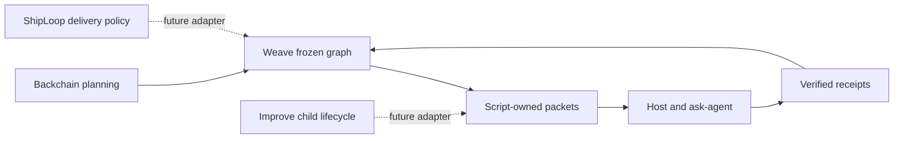

# Reference-skill review — refreshed 2026-09-18

**Decision: pilot the generic runtime; preserve each reference's ownership.**
Re-reading these skills exposed the original serial navigator's limit. Real fan-out
requires per-action claims and handles, not a renamed single cursor. The v2 design
retains the storage/evidence contract and adds an explicit native-agent frontier.

| Reference | What we use | Boundary retained |
| --- | --- | --- |
| ShipLoop | Durable Markdown, script-issued packets, transaction recovery, bounded handoff | Its SDLC stages and single current owner stay in ShipLoop; no migration claim |
| Backchain | Draft, backward dependency discovery, technical lenses, selected Until Loop convergence, structural packaging | Converged planning is not successful execution; package-only does not prove semantic review |
| Backchain graph navigator | Direct-supplier readiness, bounded claims, token-bound receipts, all-node terminal predicate | Experimental reference, not a newly imported runtime dependency; graph independence is not write safety |
| ask-agent | Fresh native async workers, explicit ownership, actual handle, useful parent work, native collection | A file appearing is not worker completion; saved handles do not guarantee session recovery |
| Improve / Until Loop | Separate review-loop ownership and retained terminal evidence | No per-leaf hidden review loops; a future child adapter must keep the parent pending until import |
| skill-interop | Package-local CLI binding, one portable card, honest host matrix | Discovery, installation and execution remain separate claims |
| skill-creator | Thin card and conditional references | No repeated manuals in the card, no global install merely to test source behavior |
| agentic-execution | Focused implementation, tests and independent review | This is our development workflow, not another runtime scheduler |
| plan-test | Behavioral fixtures for readiness, evidence and completion | Tests assert observable transitions, not wording matches |
| evidence-first-recommendations | Local source inspection, prior-art comparison, bounded pilot | No new services, packages or persistent host integrations are needed |

## Decisive source locations

- [ShipLoop SKILL.md - ownership: one active controller](/Users/dadleet/src/skill-craft/skills/shiploop/SKILL.md:213).
- [ShipLoop SKILL.md - child handling: incomplete child holds parent](/Users/dadleet/src/skill-craft/skills/shiploop/SKILL.md:247).
- [Backchain SKILL.md - native procedure: mandatory lenses and selected convergence binding](/Users/dadleet/src/backchain/skills/backchain/SKILL.md:50).
- [convergence.md - binding: selected Until Loop owns convergence](/Users/dadleet/src/backchain/skills/backchain/references/convergence.md:7).
- [navigator.js - snapshot: direct dependencies and all-node completion](/Users/dadleet/src/backchain/experiments/graph-navigator/navigator.js:656).
- [navigator.js - claim: bounded durable claims](/Users/dadleet/src/backchain/experiments/graph-navigator/navigator.js:753).
- [navigator.js - done: independent token-bound acceptance](/Users/dadleet/src/backchain/experiments/graph-navigator/navigator.js:806).
- [ask-agent SKILL.md - launch and collect: fresh workers and native results](/Users/dadleet/src/skill-craft/skills/ask-agent/SKILL.md:39).
- [Improve SKILL.md - child ownership: parent imports accepted child evidence](/Users/dadleet/src/skill-craft/skills/improve/SKILL.md:91).
- [Improve SKILL.md - concurrency boundary: separate run files do not isolate a checkout](/Users/dadleet/src/skill-craft/skills/improve/SKILL.md:213).
- [Until Loop SKILL.md - state lifecycle: ephemeral state is removed at termination](/Users/dadleet/src/until-loop/SKILL.md:147).
- [skill-interop SKILL.md - review: contract, prompts, scripts and host honesty](/Users/dadleet/.codex/skills/skill-interop/SKILL.md:83).

These are inspected local source locations, not portable package requirements.
At execution time the host selects actual available skill roots; it never guesses
these author's-machine paths. Installed copies may differ from source checkouts.

## Applied changes and remaining boundaries

The driver now routes planning details and concurrency details to separate
references. It explicitly retains Backchain's companion report, starts independent
claimed workers before collecting them, and waits for every required native result.
The README explains values, source invocation, host requirements, state recovery
and the difference between graph topology and concurrent execution.

The script checks structural plans and machine-verifiable evidence. The host still
owns checking that Backchain's semantic companion exists and honestly records its
reviews. Concurrent write ownership is cooperative and explicitly selected;
undeclared writes are not prevented by a sandbox. Per-agent worktrees, guarded
integration, child-engine adapters and ShipLoop parity remain future milestones.

The concurrency policy is deliberately all-required. Other workflow systems offer
first-success races as a separate mode; Serverless Workflow's `fork.compete` is one
example. Weave does not implement a race-winner shortcut that could silently leave
required leaves unfinished. [Serverless Workflow task flow](https://serverlessworkflow-specification.mintlify.app/core/task-flow).

## Integration drift found by the assumption audit

The selected Backchain changed from 0.3.3 to 0.3.4 after the initial pilot. Its
current convergence reference binds the selected Until Loop as the sole recurrence
and terminal authority. Weave's copied pass-ceiling/inline-review guidance was stale
and has been replaced by selected-source routing and retained terminal evidence.
The original v1 pilot remains historical evidence for the then-selected contract;
its inline reviews are not evidence of current Until Loop completion. The current
validation-plan experiment retains an actual Until Loop receipt separately.
