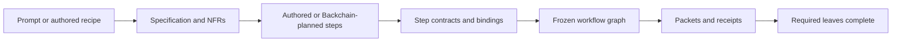
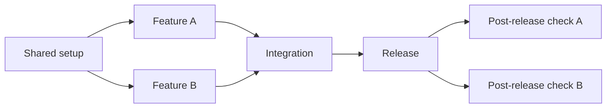

# Specification-first workflows

Weave freezes a requirement baseline before it freezes executable work. The
baseline makes a prompt, its functional requirements, its quality constraints,
and each atomic execution step reviewable after the conversation that created
them has ended.



The script freezes and hashes the accepted specification under
`requirements/spec.md` and `requirements/nfrs.md` in the run directory. Those
files are derived from the state held in `state.md`; edit neither one to change
an accepted run. A changed request, specification, or NFR starts a new run.

## Three entry paths

| Entry | Requirement baseline | Next transition |
| --- | --- | --- |
| Authored recipe | Inline `specification` in a workflow document version 2 | Validate contracts, freeze the graph, and issue the first ready action. |
| Prompt | A returned `specification` packet | Write the proposed specification, then submit the packet's exact `accept-spec` callback before Backchain planning begins. |
| Existing specification | A JSON file supplied with `--spec-file` | Validate and freeze it, then issue the Backchain planning packet without a drafting callback. |

The three paths use the same specification shape. Prompt planning does not
derive executable commands from prose: Backchain still supplies the dependency
plan, and per-step execution bindings still name exact commands, prompts,
outputs, and checks.

## Specification contract

The specification is JSON with version `1`. It is deliberately small enough to
review in one pass while retaining the trace needed to reject an ungrounded
plan.

```json
{
  "version": 1,
  "goal": "Create a checked release note from a short source note.\n",
  "deliverables": [
    {
      "id": "D-note",
      "description": "A checked release note",
      "requirements": ["FR-note"]
    }
  ],
  "functional_requirements": [
    {
      "id": "FR-note",
      "description": "The source facts appear in the release note.",
      "acceptance": ["published.md contains the accepted source facts"]
    }
  ],
  "nfrs": [
    {
      "id": "NFR-evidence",
      "description": "Accepted evidence remains separately inspectable.",
      "acceptance": ["each accepted output has its own immutable receipt"],
      "scope": "all"
    }
  ],
  "assumptions": [],
  "out_of_scope": [],
  "unresolved": []
}
```

`goal` is byte-for-byte the prompt for a prompt-origin run. A deliverable names
one coherent outcome, and its `requirements` names the functional requirements
that belong to it. Each requirement and NFR has an ID, description, and
observable acceptance criteria. An NFR applies to `"all"` deliverables or to an
explicit nonempty array of deliverable IDs. Its optional `verification_stage` is
`"outcome"` by default; only an explicit `"readiness"` NFR may be checked by a
setup ancestor before implementation begins. `unresolved` must be empty before a
specification can be accepted; it is an honest reason to clarify or revise the
specification, not a field to erase.

The schema rejects unknown fields, duplicate IDs, dangling references, blank
criteria, and a functional requirement owned by zero or multiple deliverables.
It checks traceability, not whether a sentence truthfully describes a useful
product outcome.

## Atomic step contracts

Every new authored step and every Backchain execution binding carries a
`contract`. It links the bounded work to one requirement baseline instead of
making the graph depend on a title or a planner's prose.

```json
{
  "id": "write-note",
  "kind": "command",
  "needs": ["prepare-source"],
  "argv": ["python3", "-c", "..."],
  "outputs": ["draft.md"],
  "contract": {
    "role": "deliverable",
    "deliverables": ["D-note"],
    "requirements": ["FR-note"],
    "verifies": [],
    "ready_when": ["the accepted source evidence is available"],
    "done_when": ["draft.md contains the sourced note"]
  }
}
```

An atomic **deliverable** step does one coherent, independently reviewable unit
of product work. It owns exactly one deliverable and names the functional
requirements it implements. It can be as large as a vertical feature slice;
atomic does not mean one file, one command, or one model turn.

The other roles make necessary cross-cutting work explicit:

| Role | Purpose | Required graph relationship |
| --- | --- | --- |
| `setup` | Establish a shared, evidence-producing prerequisite. | It is an ancestor of every deliverable implementation in its declared scope. |
| `deliverable` | Implement one coherent deliverable. | It owns exactly one deliverable and nonempty functional requirement set. |
| `integration` | Combine outcomes that genuinely need to meet. | It is downstream of every scoped deliverable implementation. |
| `verification` | Check a requirement or NFR against produced evidence. | It is at or downstream of the work it verifies. |
| `release` | Perform a scoped publish, deploy, or other global effect. | It is downstream of every scoped implementation. A post-release check may follow it. |

`setup`, `integration`, `verification`, and `release` are shared roles. They
must declare their scoped deliverables and a `shared_reason`; they do not hide
functional implementation behind a generic "everything" step. A release can
be global when the graph says why and contains the fan-in that makes it safe to
attempt. A verification step may come after a release when the acceptance
condition requires the deployed behavior.

Every contract declares `ready_when` and `done_when`. The script uses graph
edges and accepted receipts to determine actual readiness; these criteria tell
the host what the transition means and what evidence to collect. A contract
also names `verifies`: every functional requirement needs an implementing step
and a verifier at that step or a descendant, while each applicable outcome NFR
needs verification coverage after the scoped work. A setup can verify an explicit
readiness NFR only when it is an ancestor of every scoped implementation. Packets
include the contract, all functional requirements in the declared deliverable
scope, and all NFRs applicable to that step.

## Fan-out, joins, and release checks



The setup step is shared only because it produces an actual prerequisite for
both feature steps. Feature A and Feature B are separate deliverables and may
be independently ready. The integration/release node names both scopes and
waits for both receipts. The two post-release checks are terminal leaves: the
run is incomplete until both have accepted receipts, even though neither fans
back in to a synthetic final node.

This graph is an execution contract, not a claim that the two features are safe
to run simultaneously. Dependency independence permits parallel planning or
delegation. Actual shared-workspace concurrency remains opt-in, agent-only, and
requires separate declared output leases. The engine cannot discover shared
services, caches, credentials, deployment targets, or other external resource
conflicts.

## Prompt planning and Backchain

For a prompt, first accept the Weave specification. Then load the selected
Backchain skill and its required references, including its selected Until Loop
binding. New specification-based runs use the frozen request/specification as a
`backchain-caller/v1` source-aware companion. Keep the source identities,
requirement mapping, lens findings, and opaque Until Loop terminal receipt in
that companion; the closed Backchain plan JSON remains a plan document.

Backchain owns dependency discovery and its selected Until Loop owns planning
convergence, recovery, and terminal status. Weave accepts a structurally
packaged plan only after the host has fulfilled that selected planning contract;
it does not invent a second review counter or treat structural packaging as
semantic convergence. See [prompt planning guidance](../skills/workflow/references/planning.md).

The plan's direct supplier IDs become `needs`. The binding's contract supplies
the requirement trace. A suggested `parallel_groups` field is planning advice,
not a grant to run arbitrary commands concurrently. Weave does not add edges,
infer a join, or convert a prose dependency into an executable command.

## What the validation proves

The validation can prove that IDs resolve, scopes are covered, graph guards are
present, and all required leaves wait for their declared suppliers. It cannot
prove that a planner split work at the right product boundary, that an NFR is
adequately tested, that the source material is current, or that parallel steps
will avoid an undeclared shared resource. The host and reviewers still assess
those questions from the specification, the Backchain companion, the step
criteria, and actual receipts.

Legacy persisted runs keep their issued protocol. They do not become invalid
because this capability adds specification-first contracts to new runs.
