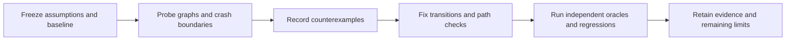

# Adversarial validation — 2026-09-18



The experiments changed two implementation decisions: completion verifiers now
have durable intent and recovery, and output paths use a conservative portable
alias policy. They also falsified a stronger ownership assumption: hashing a
shared file cannot establish which worker produced it. That remains a documented
boundary, with an executable counterexample.

**Final suite: 91 tests passed in 69.522 seconds; zero failures or skips.** The
pass adds 38 tests to the earlier 53-test baseline. The
[full log](../evidence/unittest-adversarial.txt) and
[tested-file manifest](../evidence/tested-files-adversarial.json) retain the exact
files and confirm they did not change during execution. The separate 22-graph
corpus and live planning audit are reported below; their counts are not added to
the unittest total.

The [validation plan](validation-plan.md) was reviewed through the selected
Backchain 0.3.4 and Until Loop binding. It is a frozen planning artifact, not a
claim that every proposed experiment has run. This report identifies the executed
subset and the remaining work. The generic `accept-plan` contract remains
structural; the companion audit below is a separate host-side experiment.

## Decisions and falsifiers

| Assumption | Observation and decision | Evidence |
| --- | --- | --- |
| A callback can safely rerun checks after its process dies | False in the baseline: a detached verifier can survive its caller. Persist `verifying` and per-check intent before launch; unknown outcome becomes `in_doubt`, requiring reconciliation and a fresh attempt. | `tests/test_fault_regressions.py`; frozen baseline regression capture |
| One live execution lock means all effectful actions are live | False for stranded A while B owns the lock. Bind the lock to the specific action identity and reconcile A independently. | A-dead/B-live fault regression |
| Different output strings identify different files | False on case-insensitive or normalization-sensitive filesystems. Reject normalized/case-folded equal and prefix paths, existing symlink components, nonregular targets and hardlinked outputs. | Alias negatives plus distinct-Unicode positive control |
| Hand-authored Braids sufficiently exercise the scheduler | Add an independent black-box ready/active/terminal oracle, mixed node kinds, shuffled declarations, varied capacities and a compound Loom graph. | [Graph corpus](../evidence/graph-matrix.json); `tests/test_generated_graphs.py` |
| Disjoint declarations prove actual writer identity | **Falsified.** A's verifier wrote B's output; B then earned a receipt without B writing it. Keep trusted cooperative ownership; do not claim sandboxing or provenance. | [Retained probe](../evidence/ownership-boundary.json); `tests/test_ownership_boundary.py` |
| Planning evidence can follow a same-named ambient skill | Bind the selected Backchain and Until Loop sources, exact candidate, request and terminal receipt. Audit mechanical consistency separately from semantic quality. | `planning/compatibility-native.json`; `experiments/planning_binding_audit.py` |

The final fault tests ran against the frozen pre-change runtime and produced
**five failures and two errors across nine tests**, then passed all nine against
the repaired runtime. The red run exposes wrong recovery states, blocked cold reads
and accepted path aliases; two baseline cases already passed. The retained
[baseline log](../evidence/fault-baseline-red.txt) and
[source/test identity](../evidence/fault-baseline-red.json) make this a regression
sensitivity check rather than merely a green assertion count.

## Compound graph trace

Loom combines repeated joins with overlapping suppliers. H requires E and F; I
requires F and G; J requires H and I; J then releases K and L. M is an independent
terminal prompt. Mixed command/prompt nodes remain exclusive even when they are
dependency-ready. The recipe is [reviewable JSON](../../examples/loom.workflow.json)
with a paired [sample request](../../examples/loom.request.txt).

For example, accepting E alone leaves H held. Accepting F makes H eligible, but I
still waits for G. Even after J, K and L complete, an unaccepted M prevents terminal
success. The oracle derives these facts from direct declared edges and its own
accepted/active sets; it does not import the engine's scheduler. The generated
corpus also preserves explicitly declared transitive dependencies in receipt sets.

## Implemented coverage

| Test slice | Meaningful coverage |
| --- | --- |
| `test_generated_graphs.py` | Eight deterministic DAG variants in the default suite, capacities 2/3/5, partial claims, mixed command/prompt/agent nodes, declaration permutations, cold reads, exact direct receipt sets, Loom and redundant edges |
| `test_fault_regressions.py` | Killed prompt/agent verifier owners, live read during verification, identical/conflicting callback races, dead A while B verifies, portable path aliases, symlink/hardlink preflight and valid Unicode paths |
| `test_recovery_matrix.py` | Death after the journal and each of three writes/two deletes; death during recovery; malformed journal negatives; interrupted claim and receipt acceptance; semantically invalid re-sealed state |
| `test_verifier_outcomes.py` | Ordered multiple checks, durable failure/timeout behavior and replay boundaries |
| `test_ownership_boundary.py` | Explicit shared-file writer-identity counterexample, treated as a limitation test |
| `test_planning_binding_audit.py` | Current terminal shape and mismatched candidate/request/source/binding/evidence negatives, without introducing a second convergence loop |
| Existing suite | v1 behavior, authored and prompt-entry fixtures, real Backchain structural packaging, native dispatch protocol, dependency joins, all-required terminal leaves, immutable evidence and Git worktree isolation |

The larger graph runner retains each seed, compact graph, CLI trace, capacities,
source hashes, packet sizes, transition count and elapsed time. Size and latency
are observations, not a token-efficiency claim or performance threshold. Every
case has a subprocess timeout, wall deadline and transition budget. Temporary
workspaces are removed and cleanup is checked.

Three deliberately invalid packets test the oracle itself: premature completion,
missing direct dependency receipts and excess capacity. These are **oracle
self-tests**, not source mutants and not three additional engine executions.

The extended matrix completed **22/22 graphs, 176 accepted nodes and 912 recorded
CLI transitions**: seeds 0–19 plus Loom and a redundant-edge fixture. All three
oracle self-tests rejected their invalid input, every temporary case was removed,
and runtime hashes remained unchanged. The default suite reruns eight of those
seeded graphs; its graph cases are not an additional disjoint corpus.

The retained current planning companion audits as **consistent: seven selected
sources and six domain-evidence records**, with no mismatch codes. Its actual
Until Loop terminal status is `complete`; the candidate remains frozen. The
[audit report](../evidence/planning-binding-audit.json) is separate from the
fifteen disposable-fixture tests. Independent review also led to guards against
relative locators, empty evidence sets, unbound input candidates, directory/file
type confusion and unreadable records. Hash consistency does not authenticate
the receipt or independently establish review quality.

Storage crash cuts and verifier kills test local process interruption. They do not
simulate physical power loss, failed fsync hardware, network filesystems or all
possible instruction boundaries. Fault fixtures release their bounded verifier
children and reap directly owned CLI processes; they must not signal a stale
unverified PID merely to make teardown pass.

## Reproduce

Run from the checkout root:

```sh
# Complete suite: unit, local CLI integration, adversarial and fixture cases.
python3 -m unittest discover -s tests -v

# Larger deterministic graph corpus; native handles are explicitly simulated.
python3 experiments/graph_matrix.py --seeds 20 --output /tmp/weave-graph-matrix.json

# Retain the expected cooperative-ownership limitation.
python3 experiments/ownership_probe.py --output /tmp/weave-ownership.json

# Check the retained live planning evidence against explicit expected bindings.
python3 experiments/planning_binding_audit.py \
  --companion docs/experiments/planning/compatibility-native.json \
  --expected-bindings docs/experiments/planning/expected-bindings.json
```

Backchain packaging tests require the selected checkout, Node and Bash; set
`WORKFLOW_TEST_BACKCHAIN_ROOT` on another machine. The default suite's isolated
companion fixtures require no ambient selected skill. Auditing the retained live
planning record additionally requires its recorded source and artifact paths;
missing or changed files must produce an incomplete audit, not a substitute proof.

The final suite capture and tested-file manifest are linked from
[validation](../VALIDATION.md). Historical v1 and v2 live native runs were also
read through the changed runtime: both remained complete with unchanged files.
See [cold-recovery observations](../evidence/legacy-recovery-adversarial.json).
This was a compatibility read, not a new model dispatch or host-session reconnect.

## Next decisions, in priority order

1. **Isolated branch integration before shared source editing.** Design and test
   per-agent worktrees, base identity, conflict reporting and explicit integration
   receipts before broadening concurrency beyond cooperative disjoint outputs.
   The ownership probe supplies the falsifier for that future design.
2. **More crash boundaries when those transitions change.** Retry and planning
   acceptance transaction cuts, exhaustive tiny DAG enumeration, and real engine
   mutants remain useful follow-up work. The current seeded corpus is not an
   exhaustive graph proof. Do not silently count those proposed cases as executed.
3. **Failed initialization recovery.** A failed `--isolate` can leave a partial run
   directory; this pass does not auto-delete it. Inspect the failed setup and use
   a fresh run path only when no valid run/worktree needs recovery. Safe rollback
   requires distinguishing resources created by that attempt from prior resources.
4. **Broader host and storage validation only for a concrete consumer.** Multi-host
   locking, session reconnection, ShipLoop lifecycle parity, child-engine adapters,
   dynamic graphs and automatic merges remain separate milestones.

No new dependency, persistent host integration, installation or publication was
needed for this validation pass.

## Method references

The crash-cut design follows the useful testing principle of interrupting both
transactions and recovery, described in [SQLite's crash-testing documentation](https://www.sqlite.org/testing.html).
The independent action-sequence model draws on [Hypothesis's stateful-testing approach](https://hypothesis.readthedocs.io/en/latest/stateful.html);
the implementation here uses the standard library and fixed seeds, with no
Hypothesis dependency. Neither reference substitutes for the local evidence above.
