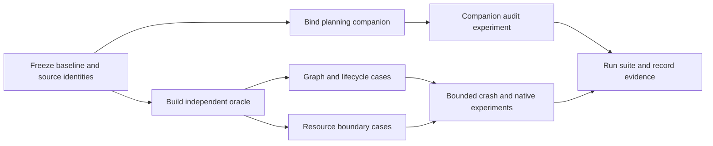

# Validation expansion plan



The next pass should strengthen the evidence, not turn every planned concern
into kernel policy. The most important correction is source-contract drift:
the selected Backchain 0.3.4 card delegates repeated semantic review and its
terminal authority to the selected Until Loop adapter. The existing generic
`accept-plan` operation deliberately validates only structural packaging and
execution bindings. We should fix the host guidance to reflect that division,
then test the evidence record that a host uses to make a semantic-planning claim.

This plan is compatibility-native, not `backchain-caller/v1`: no caller packet
with authoritative source snapshots was prepared. The canonical candidate is
[plan.json](planning/plan.json); the unedited request is
[raw-user-request.txt](planning/raw-user-request.txt). Its `parallel_groups` is
empty and structural status is intentionally unknown until a deterministic
receipt exists for this exact candidate. [The lens screen](planning/lens-screen.md)
records all 42 required applicability decisions.

## Definition of ready

Before implementation begins, retain these facts in the run evidence:

- The pre-change baseline and its file hashes are present at
  `.runs/assumption-audit-20260918/baseline-files.json`.
- The exact selected Backchain card, convergence reference, technical-lens index,
  Until Loop card, and its package-relative ephemeral adapter are readable and
  hash-bound in the companion.
- The scope is limited to this repository's tests, examples, documentation, and
  a host-side audit helper if needed. `accept-plan`, ShipLoop, Backchain, and
  Until Loop product code do not change.
- Every randomized or generated test has a fixed seed, a small reproducible
  failing case format, fresh filesystem fixtures, and an independent oracle.
- Each live experiment has a predeclared success condition, falsifier, allowed
  effects, cleanup, scope, and decision consequence. No test assumes an external
  provider or a recovered native session unless it actually observes one.

## Definition of done

The implementation is done only when all of these are true:

- Host planning guidance says that Backchain's selected Until Loop binding owns
  semantic recurrence, terminal receipt, and review streak; it does not describe
  an invented Backchain pass counter or make semantic evidence a generic kernel
  requirement.
- The new model, adversarial, recovery, resource, and companion-audit cases pass
  together with the existing suite. A failure saves its seed, graph, action trace,
  and relevant packet/receipt paths.
- At least the experiments below have result reports with their actual outcome,
  cleanup observation, and decision. A negative result changes the decision; it
  is not retried until green.
- The full test command finishes with no skips that cover a modified contract,
  and a fresh tested-file hash manifest identifies the runtime, tests, examples,
  helper, and guidance used for that run.
- The final validation report separates structural packaging, simulated protocol
  results, native delegation evidence, and untested boundaries. No result claims
  multi-host safety, undeclared-write prevention, exactly-once effects, or
  semantic planning quality outside the evidence's actual scope.

## Workstreams and dependencies

| ID | Depends on | Work and owner boundary | Observable result |
| --- | --- | --- | --- |
| W1 | baseline | Correct planning/reference wording and define a host-only companion record. Do not alter generic kernel acceptance. | Current selected-source contract is unambiguous. |
| W2 | baseline | Add a deterministic frontier oracle and reusable scenario fixture utilities using only the standard library. | Expected readiness, active set, and terminal predicates are calculated outside the runtime. |
| W3 | W2 | Add graph topology and lifecycle tests through the public CLI, including generated small DAGs and hand-authored compounds. | Runtime transitions match the oracle and direct-edge contract. |
| W4 | W2 | Add resource, evidence, transaction, and workspace negative controls. | Detected protections and cooperative-only gaps are explicit. |
| W5 | W1 | Add host-companion identity/receipt audit tests and a real selected Until Loop binding experiment. | Forged or stale semantic claims fail outside the kernel. |
| W6 | W3,W4,W5 | Run bounded crash/native experiments and the full suite; retain manifests and reports. | Decisions are supported by actual, scoped observations. |

W2, W1 can proceed independently after the baseline. W3, W4, and W5 then fan
out. W6 fans in every evidence-producing track; a green topology suite alone
cannot close the resource or source-binding branches.

## Test matrix

The test names below are acceptance cases, not implementation wording. Existing
tests remain valuable; these add combinations and falsifiers they do not yet
establish.

| Area | Cases to implement | Expected oracle/negative control |
| --- | --- | --- |
| Generated graph model | Enumerate all acyclic labeled graphs through a small fixed size and a deterministic random corpus above it; permute declaration order; vary roots, sinks, and capacity. | A step is ready exactly when every direct dependency has an accepted receipt and it is neither completed nor active. Completion means all declared steps accepted and no active actions. |
| Repeated joins | Braid-with-side-leaf, nested diamonds, fan-out after a join while a separate root remains active, and asymmetric tributaries. | A join waits only for all direct suppliers; no depth-wave barrier delays an otherwise-ready branch; side leaves still block terminal success. |
| Capacity and claim identity | More ready agents than slots; slot release after success; retained failed/blocked/in-doubt lease; same request ID replay before and after completion; competing distinct request IDs. | Never exceed capacity or issue two action IDs for a step. Replay is stable and changed limits fail. A newly eligible scheduling round needs a new request ID. |
| Callback and retry races | Same successful completion from concurrent processes; conflicting result race; prepare response loss; dispatch same-handle/conflicting-handle race; retry while sibling succeeds; stale old callback after retry. | One accepted receipt per action; exact replay is harmless; conflicting/stale evidence fails; sibling receipts remain intact. |
| Terminal behavior | Unclaimed leaf, ready leaf, dispatching leaf, dispatched leaf, failed leaf, blocked leaf, in-doubt leaf, and a command held behind active agents. | None can yield `complete`; blocked/failed ownership remains until explicit reconciliation. |
| Command/prompt exclusivity | Ready command or prompt alongside active agents, command auto-run after active agents drain, and a command-only graph in v2. | Commands/prompts/planning remain exclusive; an agent batch is never silently joined by a non-agent action. |
| Evidence integrity | Agent alters accepted upstream evidence; agent returns a symlink/dir/missing output; output is preexisting, unchanged, or rewritten by a stale writer; verifier/check log tampering. | Acceptance fails or becomes in-doubt without rewriting accepted history. Distinguish detected declared-output failures from unprevented undeclared writes. |
| Paths and fixtures | Duplicate/overlapping/prefix paths; traversal, empty segment, absolute, backslash, Unicode, and symlink alias cases; state/lock/journal symlink races. | Unsafe or ambiguous paths reject before execution; fresh fixtures do not leak into later cases. |
| Transaction cuts | Inject failure after every state/packet/receipt write for claim, complete, retry, and planning acceptance; recover cold. | Recovery either rolls the one intended transaction forward or reports a safe error; it never makes a phantom completion or a duplicate action. |
| Version and source identity | v1 cold recovery after v2 additions; v2 state policy tampering; selected card relocation/copy; source hash changes after binding; plan/terminal-receipt mismatch. | Legacy behavior remains readable; invalid state is rejected; companion audit becomes incomplete rather than silently accepting same-named sources. |
| Planning boundary | Structurally complete package with no semantic companion; valid companion with a `stopped` receipt; complete receipt for a different candidate/binding; exact raw request including CRLF/Unicode. | Kernel may accept structural graph only; host semantic convergence cannot be claimed unless identity and exact selected terminal receipt agree. |

The generated model should be deliberately small enough to shrink failures. Store
the random seed, canonical graph JSON, expected trace, command output, and action
IDs on failure. It should never calculate expected results by calling
`workflow_core` or by copying its topological scheduling implementation.

## Bounded experiments

| Experiment | Assumption under test | Setup and controls | Falsifier | Cleanup and decision |
| --- | --- | --- | --- | --- |
| E1: model-oracle corpus | Hand-authored Braids did not hide a readiness/terminal regression. | Fresh temp roots; fixed seed corpus plus exhaustive small DAGs; simulated native handles; public CLI only. | Any runtime ready/active/complete observation differs from the independent model. | Temp roots removed. Any mismatch blocks expansion and becomes a minimized regression fixture. |
| E2: lifecycle crash cuts | Durable claim/dispatch/receipt transitions are safe across the testable local crash boundaries. | Stop a subprocess or inject store faults immediately before/after persisted intent, claim, handle, receipt, and terminal transition. Read only from a new process. | A fresh read authorizes a duplicate launch, loses a previously accepted receipt, or reaches complete with an active/missing step. | Kill only test-owned children/process groups; remove temp run. Failure blocks a reliability claim and receives a focused recovery fix. |
| E3: cooperative-lease adversary | Declared disjoint outputs are sufficient isolation for shared-workspace agent work. | One deliberately hostile simulated agent writes a sibling's declared output, a prior accepted output, and an undeclared source file; compare receipts and Git/file snapshots. | The engine accepts an undeclared source/sibling mutation without a detectable declared-evidence failure. This outcome is expected to be possible under the documented cooperative policy. | Fresh temp workspace/worktree; retain only decision report. If observed, keep concurrent source mutation out of scope and require per-agent isolation or an enforcement design before expansion. |
| E4: selected-source planning companion | A host can prove what it reviewed without changing kernel semantics. | Bind current selected Backchain/Until Loop locators and SHA-256 values to this candidate; run the selected Until Loop ephemeral adapter through its real terminal receipt; audit copied/stale/mismatched variants. | Missing/changed source, absent terminal packet, non-complete terminal status, binding mismatch, or candidate digest mismatch is incorrectly reported converged. | Adapter removes its temporary state at terminal; persist the exact terminal stdout under `planning/`. A pass validates only this host evidence record, not model quality or kernel policy. |
| E5: native Braid replay | The earlier live Braid remains reproducible with real native handles and all leaves awaited. | Clean, isolated local run; capacity two; two rounds of actual fresh native workers; parent verifies holds before joins and retains actual handles. | A join releases early, a terminal leaf is forgotten, a handle is fabricated, or a cold replay changes accepted evidence. | Preserve ignored run artifacts and summary; do not claim handle reconnection or multi-host support. A failure blocks any “live native fan-out” statement. |

E3 is a boundary-discovery experiment, not a promise that the current engine will
reject every hostile write. Its useful result is a precise decision: either the
observed enforcement is stronger than expected, or concurrent shared-source work
remains prohibited until a separate isolated-worktree/integration design exists.

## Planning companion contract

The host-side record should remain an audit artifact, initially verified by a
small standard-library helper/test rather than parsed by `accept-plan`. It needs:

- exact raw request bytes and SHA-256;
- input and final candidate locators and SHA-256 values;
- `mode: native`, `route: compatibility-native`, and
  `structural_plan_status: unknown` unless a deterministic receipt for that exact
  candidate is also recorded;
- selected Backchain card, convergence reference, full lens index, selected Until
  Loop card, and package-relative adapter locators plus SHA-256 and observed Git
  revision/cleanliness when available;
- the all-lens applicability screen, exact Until Loop terminal stdout, binding
  ID, candidate identity, domain evidence, and planning gaps; and
- an explicit statement that a structural `accept-plan` result proves packaging
  and bindings only, while the host owns semantic convergence assessment.

Forgery tests alter one field at a time: candidate digest, request digest,
binding ID, terminal status, terminal candidate identity, selected-card path,
adapter hash, or source hash. The audit must return *incomplete*, never quietly
substitute a same-named ambient card or grant generic kernel acceptance.

## Evidence capture

Run focused suites during implementation, then run:

```sh
python3 -m unittest discover -s tests -v
```

Capture its stdout, exit code, elapsed time, skipped tests, selected source
hashes, and a tested-file manifest only after the code stops changing. Keep
experiment raw packets/temporary state outside version control if they include
ephemeral paths; retain an auditable summary plus stable source/candidate/receipt
hashes in `docs/evidence/`. A green test command is evidence for its local files
and host only; live-native, structural-package, and semantic-companion claims
need their own receipts.
